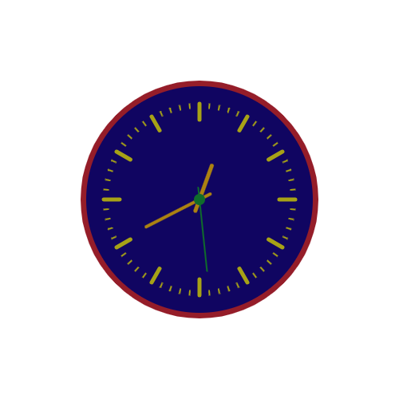

# Clock project

https://animatedclockbis.netlify.app/

In this vanilla JS app,we use the **HTML canvas element** with the **canvas scripting API** to draw clock graphics and animations.The **window.requestAnimationFrame()** method is invoked to tell the browser to perform an animation. It requests the browser to call the **clock** function before the next repaint. Note that we use **recursion** inside the **clock** function to animate another frame since **requestAnimationFrame()** method is one-shot. A **new Date()** object is used to determine the local time and position the hour, minute, and second clock hands accordingly by rotating hands to the correct readings at each clock repaint. A **form** element is used to customize the clock face with desired colors. The selected colors are saved in the **localStorage** to maintain the desired styles when the window loads. Note that a **clock.png** will be downloaded upon the form submission and your preferred styles will be saved in your local browser storage. Clone the repo and open the **index.html** to run the ptoject.
Thank you for visiting this repository. Feedbacks are welcomed and can be emailed to bishimwe84@gmail.com.

# Animated-Clock
